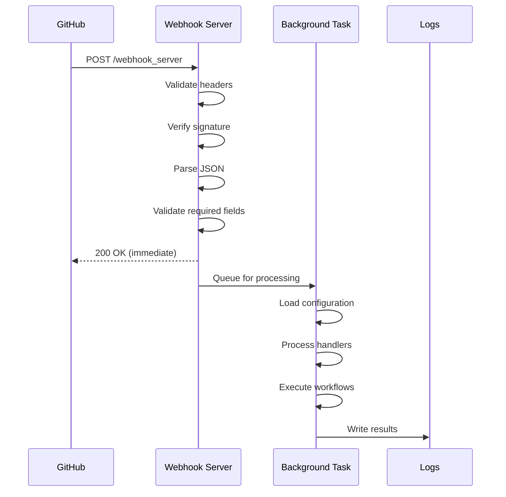

## Overview

The webhook endpoint receives and processes GitHub webhook events. It returns an immediate 200 OK response after validation and processes webhooks asynchronously in the background to prevent GitHub webhook timeouts.

## Endpoint

```
POST /webhook_server
```

## Request Headers

<ParamField header="X-GitHub-Event" type="string" required>
  GitHub event type (e.g., `pull_request`, `push`, `issue_comment`, `check_run`, `pull_request_review`)
</ParamField>

<ParamField header="X-GitHub-Delivery" type="string" required>
  Unique delivery ID for tracking webhook processing in logs
</ParamField>

<ParamField header="X-Hub-Signature-256" type="string">
  HMAC-SHA256 signature for webhook payload verification (required if `webhook-secret` is configured)
</ParamField>

## Request Body

The request body contains the GitHub webhook payload as JSON. The exact structure depends on the event type.

<ParamField body="repository" type="object" required>
  Repository information from GitHub webhook payload
  
  <ParamField body="repository.name" type="string" required>
    Repository name (without owner)
  </ParamField>
  
  <ParamField body="repository.full_name" type="string" required>
    Full repository name in `owner/repo` format
  </ParamField>
</ParamField>

<ParamField body="action" type="string">
  Action that triggered the webhook (event-specific, e.g., `opened`, `synchronize`, `closed`)
</ParamField>

<ParamField body="sender" type="object">
  User who triggered the webhook event
</ParamField>

For complete webhook payload schemas, see [GitHub Webhook Events Documentation](https://docs.github.com/en/webhooks/webhook-events-and-payloads).

## Response

<ResponseField name="status" type="integer">
  HTTP status code (200 for successful validation)
</ResponseField>

<ResponseField name="message" type="string">
  Status message indicating webhook was queued for processing
</ResponseField>

<ResponseField name="delivery_id" type="string">
  GitHub delivery ID for tracking this webhook in logs
</ResponseField>

<ResponseField name="event_type" type="string">
  GitHub event type that was received
</ResponseField>

## Background Processing

**Critical Design Pattern:** This endpoint returns 200 OK immediately after validation to prevent GitHub webhook timeouts (10 second limit). All processing happens asynchronously in the background.

### Synchronous Validation (must pass to return 200)

1. Read request body
2. Verify signature (if `webhook-secret` configured)
3. Parse JSON payload
4. Validate required fields: `repository.name`, `repository.full_name`, `X-GitHub-Event` header

### Background Processing (errors logged only)

- Configuration loading and repository validation
- GitHub API calls and webhook processing
- All handler execution (PR management, checks, notifications)
- All errors are caught and logged (check logs with `delivery_id` to verify results)

**Important:** HTTP 200 OK means the webhook payload was valid and queued for processing. It does NOT mean the webhook was processed successfully. Check server logs using the `delivery_id` to verify actual processing results.

## Security

### Signature Verification

When `webhook-secret` is configured, the server validates the `X-Hub-Signature-256` header using HMAC-SHA256:

```yaml
# config.yaml
webhook-secret: "your-webhook-secret"
```

The signature is computed as:

```
sha256=HMAC_SHA256(webhook-secret, request_body)
```

### IP Allowlist

Optionally restrict webhook requests to GitHub and/or Cloudflare IP ranges:

```yaml
# config.yaml
verify-github-ips: true
verify-cloudflare-ips: true
```

When enabled, requests from IPs outside the allowlist receive a 403 Forbidden response.

## Supported Events

The webhook server processes these GitHub event types:

- `pull_request` - Pull request opened, synchronized, closed, etc.
- `pull_request_review` - PR review submitted, edited, dismissed
- `issue_comment` - Comments on PRs and issues (handles user commands)
- `push` - Commits pushed to repository
- `check_run` - Check run created, completed, rerequested

Other event types are received but may not trigger automated actions.

## Status Codes

<ResponseField name="200" type="Success">
  Webhook payload validated and queued for background processing
</ResponseField>

<ResponseField name="400" type="Bad Request">
  - Missing required header: `X-GitHub-Event`
  - Failed to read request body
  - Invalid JSON payload
  - Missing required payload fields: `repository`, `repository.name`, `repository.full_name`
  - Invalid client IP address (when IP verification enabled)
</ResponseField>

<ResponseField name="401" type="Unauthorized">
  - Missing `X-Hub-Signature-256` header (when webhook secret configured)
  - Signature verification failed (invalid HMAC signature)
</ResponseField>

<ResponseField name="403" type="Forbidden">
  - Client IP not in allowlist (when IP verification enabled)
</ResponseField>

<ResponseField name="500" type="Internal Server Error">
  - Configuration error during signature verification setup
</ResponseField>

## Examples

### Basic webhook request

```bash
curl -X POST https://your-server.com/webhook_server \
  -H "Content-Type: application/json" \
  -H "X-GitHub-Event: pull_request" \
  -H "X-GitHub-Delivery: 12345678-1234-1234-1234-123456789012" \
  -d '{
    "action": "opened",
    "number": 42,
    "pull_request": {
      "id": 123456,
      "title": "Add new feature",
      "state": "open"
    },
    "repository": {
      "name": "my-repo",
      "full_name": "my-org/my-repo"
    },
    "sender": {
      "login": "contributor"
    }
  }'
```

**Response:**

```json
{
  "status": 200,
  "message": "Webhook queued for processing",
  "delivery_id": "12345678-1234-1234-1234-123456789012",
  "event_type": "pull_request"
}
```

### Webhook request with signature verification

```bash
# Generate signature
SECRET="your-webhook-secret"
PAYLOAD='{"repository":{"name":"my-repo","full_name":"my-org/my-repo"}}'
SIGNATURE=$(echo -n "$PAYLOAD" | openssl dgst -sha256 -hmac "$SECRET" | sed 's/^.* //')

curl -X POST https://your-server.com/webhook_server \
  -H "Content-Type: application/json" \
  -H "X-GitHub-Event: push" \
  -H "X-GitHub-Delivery: 12345678-1234-1234-1234-123456789012" \
  -H "X-Hub-Signature-256: sha256=$SIGNATURE" \
  -d "$PAYLOAD"
```

**Response:**

```json
{
  "status": 200,
  "message": "Webhook queued for processing",
  "delivery_id": "12345678-1234-1234-1234-123456789012",
  "event_type": "push"
}
```

## Error Responses

### Missing X-GitHub-Event header

```json
{
  "detail": "Missing X-GitHub-Event header"
}
```

### Invalid JSON payload

```json
{
  "detail": "Invalid JSON payload"
}
```

### Missing repository in payload

```json
{
  "detail": "Missing repository in payload"
}
```

### Signature verification failed

```json
{
  "detail": "Request signatures didn't match!"
}
```

### IP not in allowlist

```json
{
  "detail": "192.0.2.1 IP is not a valid ip in allowlist IPs"
}
```

## Webhook Processing Flow



## Monitoring

Use the `delivery_id` from the response to track webhook processing in logs:

```bash
# View logs for specific delivery
curl "http://your-server:5000/logs/api/entries?hook_id=12345678-1234-1234-1234-123456789012"
```

See [Log Viewer API](/api/log-entries) for complete log querying documentation.

## Related Endpoints

- [GET /webhook_server/healthcheck](/api/health-check) - Server health check
- [Log Viewer API](/api/log-entries) - Query webhook processing logs