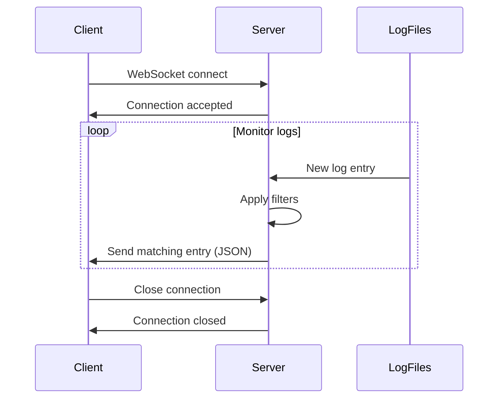

## Endpoint

```url
ws://your-server:5000/logs/ws
```

Establishes a WebSocket connection for real-time streaming of webhook log entries as they are generated. Supports filtering to receive only relevant log entries.

<Warning>
**Security Warning**: This endpoint is NOT protected by authentication. Never expose it outside your trusted network. Deploy behind a reverse proxy with authentication, use firewall rules to restrict access, and never expose WebSocket ports directly to the internet. Log streams may contain GitHub tokens, user information, repository details, and sensitive webhook payloads.
</Warning>

## Connection Parameters

All parameters are optional query parameters in the WebSocket URL. Use them to filter the log stream.

<ParamField query="hook_id" type="string">
  Filter stream by specific GitHub delivery ID
  
  Example: `ws://localhost:5000/logs/ws?hook_id=abc123-def456`
</ParamField>

<ParamField query="pr_number" type="integer">
  Filter stream by pull request number
  
  Example: `ws://localhost:5000/logs/ws?pr_number=123`
</ParamField>

<ParamField query="repository" type="string">
  Filter stream by repository name in `owner/repo` format
  
  Example: `ws://localhost:5000/logs/ws?repository=my-org/my-repo`
</ParamField>

<ParamField query="event_type" type="string">
  Filter stream by GitHub event type
  
  Example: `ws://localhost:5000/logs/ws?event_type=pull_request`
</ParamField>

<ParamField query="github_user" type="string">
  Filter stream by GitHub username
  
  Example: `ws://localhost:5000/logs/ws?github_user=octocat`
</ParamField>

<ParamField query="level" type="string">
  Filter stream by log level: `DEBUG`, `INFO`, `WARNING`, `ERROR`
  
  Example: `ws://localhost:5000/logs/ws?level=ERROR`
</ParamField>

<Note>
If no filters are provided, the WebSocket will stream **all** log entries in real-time.
</Note>

## Message Format

Each WebSocket message is a JSON object representing a single log entry:

<ResponseField name="timestamp" type="string">
  ISO 8601 timestamp (e.g., `2025-01-30T10:30:00.123000`)
</ResponseField>

<ResponseField name="level" type="string">
  Log level: `DEBUG`, `INFO`, `WARNING`, or `ERROR`
</ResponseField>

<ResponseField name="logger_name" type="string">
  Logger component name (e.g., `GithubWebhook`, `PullRequestHandler`)
</ResponseField>

<ResponseField name="message" type="string">
  Log message text
</ResponseField>

<ResponseField name="hook_id" type="string" optional>
  GitHub delivery ID (x-github-delivery)
</ResponseField>

<ResponseField name="event_type" type="string" optional>
  GitHub event type (e.g., `pull_request`, `check_run`)
</ResponseField>

<ResponseField name="repository" type="string" optional>
  Repository name in `owner/repo` format
</ResponseField>

<ResponseField name="pr_number" type="integer" optional>
  Pull request number
</ResponseField>

<ResponseField name="github_user" type="string" optional>
  GitHub username (api_user)
</ResponseField>

## Examples

### JavaScript/Browser

```javascript
// Connect to WebSocket
const ws = new WebSocket("ws://localhost:5000/logs/ws?level=ERROR");

// Handle connection open
ws.onopen = function(event) {
  console.log("WebSocket connected");
};

// Handle incoming messages
ws.onmessage = function(event) {
  const logEntry = JSON.parse(event.data);
  console.log(`[${logEntry.level}] ${logEntry.message}`);
  
  // Display in UI
  const logElement = document.createElement('div');
  logElement.className = `log-entry log-${logEntry.level.toLowerCase()}`;
  logElement.textContent = `${logEntry.timestamp} - ${logEntry.message}`;
  document.getElementById('log-container').appendChild(logElement);
};

// Handle errors
ws.onerror = function(error) {
  console.error("WebSocket error:", error);
};

// Handle connection close
ws.onclose = function(event) {
  console.log("WebSocket disconnected", event.code, event.reason);
  
  // Reconnect after 5 seconds
  setTimeout(() => {
    console.log("Reconnecting...");
    connectWebSocket();
  }, 5000);
};
```

### Python (websockets library)

```python
import asyncio
import json
import websockets

async def stream_logs():
    uri = "ws://localhost:5000/logs/ws?repository=my-org/my-repo"
    
    async with websockets.connect(uri) as websocket:
        print("Connected to log stream")
        
        try:
            async for message in websocket:
                log_entry = json.loads(message)
                print(f"[{log_entry['level']}] {log_entry['message']}")
        except websockets.exceptions.ConnectionClosed:
            print("Connection closed")

asyncio.run(stream_logs())
```

### Node.js (ws library)

```javascript
const WebSocket = require('ws');

const ws = new WebSocket('ws://localhost:5000/logs/ws?pr_number=123');

ws.on('open', function open() {
  console.log('Connected to log stream');
});

ws.on('message', function message(data) {
  const logEntry = JSON.parse(data);
  console.log(`[${logEntry.timestamp}] [${logEntry.level}] ${logEntry.message}`);
});

ws.on('error', function error(err) {
  console.error('WebSocket error:', err);
});

ws.on('close', function close(code, reason) {
  console.log(`Connection closed: ${code} - ${reason}`);
});
```

### Filter by Multiple Parameters

```javascript
const params = new URLSearchParams({
  repository: 'my-org/my-repo',
  level: 'ERROR',
  event_type: 'pull_request'
});

const ws = new WebSocket(`ws://localhost:5000/logs/ws?${params}`);
```

## Connection Lifecycle

### Connection Establishment

1. Client initiates WebSocket handshake
2. Server accepts connection and adds to active connections set
3. Server starts monitoring log directory for new entries
4. New log entries are filtered and sent to client in real-time

### Message Flow



### Disconnection

Connections are closed when:

- Client explicitly closes the connection
- Server shuts down (sends close code `1001` with reason "Server shutdown")
- Network error or timeout occurs
- Internal server error (sends close code `1011` with reason "Internal server error")

## Error Handling

### Server Errors

If the log directory is not found, the server sends an error message:

```json
{
  "error": "Log directory not found"
}
```

### Connection Errors

- **Code 1001**: Server shutdown (normal closure)
- **Code 1011**: Internal server error
- **Code 1006**: Abnormal closure (network issue)

## Use Cases

### Real-Time Monitoring Dashboard

```javascript
// Monitor all errors in real-time
const errorStream = new WebSocket('ws://localhost:5000/logs/ws?level=ERROR');

errorStream.onmessage = function(event) {
  const error = JSON.parse(event.data);
  
  // Update dashboard metrics
  incrementErrorCount();
  displayErrorNotification(error);
  
  // Log to analytics
  trackError({
    timestamp: error.timestamp,
    repository: error.repository,
    message: error.message
  });
};
```

### PR-Specific Monitoring

```javascript
// Watch logs for specific PR
function monitorPR(prNumber) {
  const ws = new WebSocket(`ws://localhost:5000/logs/ws?pr_number=${prNumber}`);
  
  ws.onmessage = function(event) {
    const log = JSON.parse(event.data);
    updatePRStatusUI(prNumber, log);
  };
  
  return ws;
}

const pr123Stream = monitorPR(123);
```

### Repository Activity Feed

```javascript
// Live activity feed for repository
const repoFeed = new WebSocket('ws://localhost:5000/logs/ws?repository=my-org/my-repo');

repoFeed.onmessage = function(event) {
  const activity = JSON.parse(event.data);
  addToActivityFeed({
    time: new Date(activity.timestamp),
    type: activity.event_type,
    message: activity.message,
    user: activity.github_user
  });
};
```

### Multi-Filter Monitoring

```javascript
// Monitor errors for specific repository
const params = new URLSearchParams({
  repository: 'my-org/critical-repo',
  level: 'ERROR'
});

const criticalErrors = new WebSocket(`ws://localhost:5000/logs/ws?${params}`);

criticalErrors.onmessage = function(event) {
  const error = JSON.parse(event.data);
  sendPagerDutyAlert(error);
};
```

## Connection Troubleshooting

### WebSocket Connection Fails

**Check firewall rules:**

```bash
# Allow WebSocket port
sudo ufw allow 5000/tcp
```

**Verify server is running:**

```bash
curl http://localhost:5000/health
```

**Check reverse proxy configuration** (if using nginx):

```nginx
location /logs/ws {
    proxy_pass http://localhost:5000;
    proxy_http_version 1.1;
    proxy_set_header Upgrade $http_upgrade;
    proxy_set_header Connection "upgrade";
    proxy_set_header Host $host;
    proxy_read_timeout 86400;
}
```

### No Messages Received

**Verify filters are correct:**

```javascript
// Check filter matches actual log data
const ws = new WebSocket('ws://localhost:5000/logs/ws?repository=correct-org/correct-repo');
```

**Test without filters:**

```javascript
// Should receive all logs
const ws = new WebSocket('ws://localhost:5000/logs/ws');
```

**Check log files exist:**

```bash
ls -la /path/to/data/logs/
```

### Connection Drops Frequently

**Implement reconnection logic:**

```javascript
function connectWebSocket() {
  const ws = new WebSocket('ws://localhost:5000/logs/ws');
  
  ws.onclose = function(event) {
    console.log('Connection closed, reconnecting in 5s...');
    setTimeout(connectWebSocket, 5000);
  };
  
  return ws;
}

let ws = connectWebSocket();
```

**Check network stability:**

```bash
ping -c 100 your-server-hostname
```

**Increase proxy timeout** (if using reverse proxy):

```nginx
proxy_read_timeout 3600s;  # 1 hour
```

### High Memory Usage

**Reduce filter scope** to minimize message volume:

```javascript
// Instead of monitoring all logs
const ws = new WebSocket('ws://localhost:5000/logs/ws');

// Monitor only specific repository and level
const ws = new WebSocket('ws://localhost:5000/logs/ws?repository=my-org/my-repo&level=ERROR');
```

## Performance Considerations

- **Memory efficient**: Server uses streaming architecture
- **Concurrent connections**: Server maintains set of active WebSocket connections
- **Filter early**: Filters applied before sending to reduce bandwidth
- **Automatic cleanup**: Connections removed from set on disconnect
- **Latency**: Less than 100ms from log generation to client delivery

## Security Best Practices

1. **Never expose WebSocket publicly** - use VPN or private network only
2. **Deploy behind authenticated reverse proxy** (mandatory for production)
3. **Use WSS (WebSocket Secure)** over TLS in production
4. **Implement client-side token authentication** for additional security
5. **Monitor WebSocket connections** and limit concurrent connections
6. **Log access to WebSocket endpoint** for audit trails

### Example Secure Configuration (nginx)

```nginx
server {
    listen 443 ssl;
    server_name logs.internal.company.com;
    
    # TLS configuration
    ssl_certificate /path/to/cert.pem;
    ssl_certificate_key /path/to/key.pem;
    
    # Basic authentication
    auth_basic "Restricted";
    auth_basic_user_file /etc/nginx/.htpasswd;
    
    location /logs/ws {
        proxy_pass http://localhost:5000;
        proxy_http_version 1.1;
        proxy_set_header Upgrade $http_upgrade;
        proxy_set_header Connection "upgrade";
        proxy_set_header Host $host;
        proxy_read_timeout 86400;
        
        # Additional security headers
        proxy_set_header X-Real-IP $remote_addr;
        proxy_set_header X-Forwarded-For $proxy_add_x_forwarded_for;
    }
}
```
