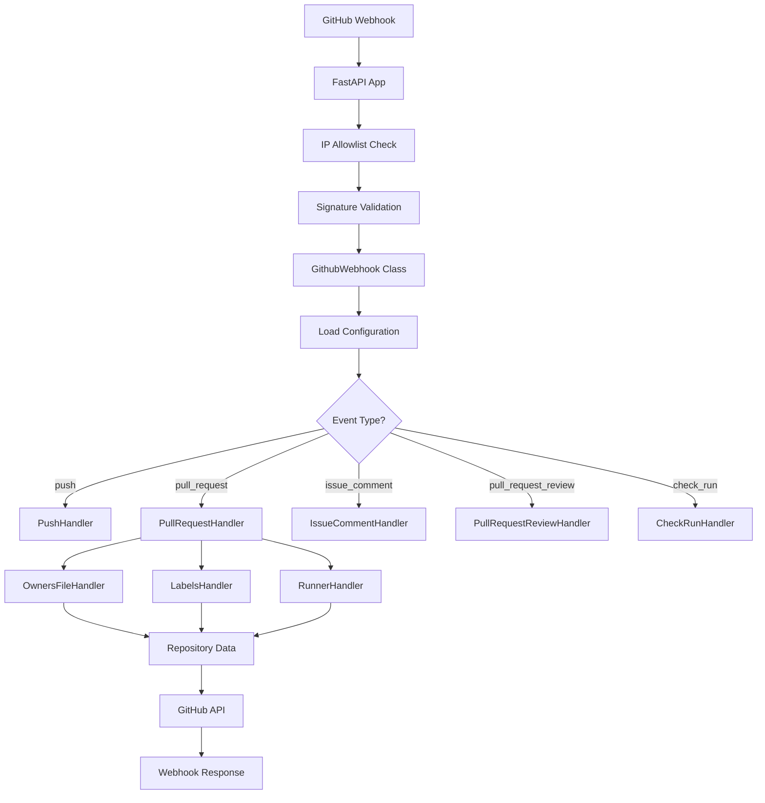

## Overview

The GitHub Webhook Server is built on a **FastAPI-based event-driven architecture** that processes GitHub webhooks through specialized handlers. The system is designed for high performance, type safety, and fail-fast reliability.

## Core Architecture Components

### FastAPI Application Layer

The webhook server runs as a FastAPI application (`webhook_server/app.py`) with:

- **Asynchronous processing** - Non-blocking webhook handling using Python asyncio
- **IP-based security** - GitHub and Cloudflare IP allowlist verification
- **Webhook signature validation** - HMAC-SHA256 signature verification
- **Health check endpoints** - `/webhook_server/healthcheck` for monitoring
- **Structured logging** - JSON-based webhook execution tracking

```python
# Main webhook endpoint
@FASTAPI_APP.post(
    f"{APP_URL_ROOT_PATH}",
    dependencies=[Depends(gate_by_allowlist_ips_dependency)]
)
async def webhook_handler(request: Request) -> JSONResponse:
    # Create structured logging context
    ctx = create_context(
        hook_id=hook_id,
        event_type=event_type,
        repository=repository_full_name,
        action=action,
        sender=sender_login,
        api_user=api_user,
    )
    
    # Process webhook with GithubWebhook class
    github_webhook = GithubWebhook(hook_data, headers, logger)
    await github_webhook.process()
```

### GithubWebhook Class - Central Orchestrator

The `GithubWebhook` class (`webhook_server/libs/github_api.py`) is the **central orchestrator** that:

1. **Validates webhook data** - Ensures required fields exist
2. **Loads configuration** - Merges global config with repository-specific `.github-webhook-server.yaml`
3. **Authenticates with GitHub** - Selects token with highest rate limit
4. **Routes to handlers** - Dispatches events to specialized handlers based on event type
5. **Tracks metrics** - Monitors API rate limit consumption and processing time

<CodeGroup>

```python Initialization
class GithubWebhook:
    def __init__(self, hook_data: dict, headers: Headers, logger: logging.Logger):
        self.hook_data = hook_data
        self.repository_name = hook_data["repository"]["name"]
        self.repository_full_name = hook_data["repository"]["full_name"]
        self.github_event = headers["X-GitHub-Event"]
        self.config = Config(repository=self.repository_name)
        
        # Get GitHub API with highest rate limit
        github_api, self.token, self.api_user = get_api_with_highest_rate_limit(
            config=self.config, repository_name=self.repository_name
        )
        
        # Get repository instances
        self.repository = get_github_repo_api(
            github_app_api=github_api, 
            repository=self.repository_full_name
        )
```

```python Event Processing Flow
async def process(self) -> Any:
    # Handle push events
    if self.github_event == "push":
        await PushHandler(self).process_push_webhook_data()
        return None
    
    # Get pull request for PR-related events
    pull_request = await self.get_pull_request()
    
    # Clone repository for file processing
    await self._clone_repository(pull_request=pull_request)
    
    # Route to event-specific handlers
    if self.github_event == "issue_comment":
        await IssueCommentHandler(self, owners_file_handler)
            .process_comment_webhook_data(pull_request)
    
    elif self.github_event == "pull_request":
        await PullRequestHandler(self, owners_file_handler)
            .process_pull_request_webhook_data(pull_request)
    
    elif self.github_event == "pull_request_review":
        await PullRequestReviewHandler(self, owners_file_handler)
            .process_pull_request_review_webhook_data(pull_request)
    
    elif self.github_event == "check_run":
        await CheckRunHandler(self, owners_file_handler)
            .process_pull_request_check_run_webhook_data(pull_request)
```

</CodeGroup>

## Event-Driven Handler Architecture

### Handler Pattern

All handlers follow a consistent pattern (`webhook_server/libs/handlers/`):

```python
class SomeHandler:
    def __init__(self, github_webhook: GithubWebhook, owners_file_handler: OwnersFileHandler):
        self.github_webhook = github_webhook
        self.owners_file_handler = owners_file_handler
        self.logger = github_webhook.logger
        self.repository = github_webhook.repository
    
    async def process_event(self, event_data: dict) -> None:
        # Event-specific processing logic
        pass
```

### Specialized Handlers

| Handler | File | Responsibilities |
|---------|------|------------------|
| **PullRequestHandler** | `pull_request_handler.py` | PR opened/reopened/edited events, reviewer assignment, label management, merge checks |
| **IssueCommentHandler** | `issue_comment_handler.py` | User commands (`/verified`, `/lgtm`, `/retest`, `/cherry-pick`) |
| **PullRequestReviewHandler** | `pull_request_review_handler.py` | Review submitted/dismissed, approval tracking, review labels |
| **CheckRunHandler** | `check_run_handler.py` | CI check completion, merge eligibility, auto-merge |
| **PushHandler** | `push_handler.py` | Branch pushes, tag creation, container building |
| **OwnersFileHandler** | `owners_files_handler.py` | OWNERS file parsing, reviewer/approver assignment |
| **LabelsHandler** | `labels_handler.py` | Label application, PR size calculation, branch labels |
| **RunnerHandler** | `runner_handler.py` | Test execution (tox, pre-commit, container builds) |

## Repository Data Pre-Fetch Pattern

<Note>
**Performance Optimization:** Repository data is fetched **once per webhook** before handlers are instantiated, preventing duplicate API calls.
</Note>

The `GithubWebhook` class pre-fetches comprehensive repository data:

```python
# In GithubWebhook.process() - after PR data, before handlers
self.repository_data = await self.unified_api.get_comprehensive_repository_data(
    owner, repo
)

# Handlers access pre-fetched data directly
collaborators = self.github_webhook.repository_data['collaborators']['edges']
protected_branches = self.github_webhook.repository_data['protected_branches']
```

**Benefits:**
- ⚡ **Reduced API calls** - Single fetch vs multiple handler calls
- 🚀 **Faster processing** - Parallel data access from cached dict
- 💰 **Lower rate limit consumption** - Critical for high-volume repositories

## Repository Cloning Strategy

### Optimized Cloning for check_run Events

For `check_run` events, the server implements **early exit conditions** to avoid unnecessary cloning:

```python
if self.github_event == "check_run":
    action = self.hook_data.get("action", "")
    if action != "completed":
        return None  # Skip clone for 'created' action
    
    check_run_name = self.hook_data.get("check_run", {}).get("name", "")
    check_run_conclusion = self.hook_data.get("check_run", {}).get("conclusion", "")
    
    if check_run_name == "can-be-merged" and check_run_conclusion != "success":
        return None  # Skip clone for failed can-be-merged checks
    
    # Only clone when actually needed
    await self._clone_repository(pull_request=pull_request)
```

**Impact:**
- 🎯 **90-95% reduction** in unnecessary repository cloning
- ⏱️ **5-30 seconds saved** per skipped clone
- 📉 **Lower server resource usage**

### Worktree Isolation

Handlers create isolated worktrees from a single repository clone:

```python
# Single clone per webhook
await self._clone_repository(pull_request=pull_request)

# Handlers create isolated worktrees for concurrent operations
worktree_dir = f"{self.clone_repo_dir}-worktree-{handler_name}"
await run_command(f"git worktree add {worktree_dir} {branch}")
```

## Non-Blocking PyGithub Operations

<Warning>
**Critical Requirement:** PyGithub is synchronous - **ALL operations MUST use `asyncio.to_thread()`** to prevent blocking the event loop.
</Warning>

The architecture requires wrapping **all PyGithub operations** in `asyncio.to_thread()`:

```python
# ✅ CORRECT - Non-blocking
await asyncio.to_thread(pull_request.create_issue_comment, "Comment")
await asyncio.to_thread(pull_request.add_to_labels, "verified")
is_draft = await asyncio.to_thread(lambda: pull_request.draft)

# ❌ WRONG - Blocks event loop
pull_request.create_issue_comment("Comment")  # Freezes server!
is_draft = pull_request.draft  # Blocks for 100ms-2s
```

**Why this matters:**
- 🔴 Blocking calls freeze the entire server
- 🚫 Incoming webhooks must wait
- ⏱️ Each GitHub API call blocks 100ms-2 seconds
- 🎯 `asyncio.to_thread()` keeps event loop responsive

## Configuration System

The configuration system (`webhook_server/libs/config.py`) supports:

### Hierarchical Configuration

```python
class Config:
    def get_value(self, value: str, return_on_none: Any = None) -> Any:
        # Order of precedence:
        # 1. Repository-specific .github-webhook-server.yaml
        # 2. Repository level in global config.yaml
        # 3. Root level in global config.yaml
        for scope in (self.repository_data, self.root_data):
            result = self._get_nested_value(value, scope)
            if result is not None:
                return result
        return return_on_none
```

### Schema Validation

- **JSON Schema** - `webhook_server/config/schema.yaml` defines all valid fields
- **IDE Support** - Schema URL in config YAML enables autocompletion
- **Type Checking** - Validates strings, integers, booleans, arrays, objects
- **Cross-field Validation** - Ensures configuration consistency

```yaml
# yaml-language-server: $schema=https://raw.githubusercontent.com/myk-org/github-webhook-server/refs/heads/main/webhook_server/config/schema.yaml

github-app-id: 123456
webhook-ip: https://your-domain.com/webhook_server
github-tokens:
  - ghp_your_github_token

repositories:
  my-repository:
    name: my-org/my-repository
    protected-branches:
      main: []
```

## Structured Logging & Metrics

### Webhook Context Tracking

Every webhook execution creates a structured context (`webhook_server/utils/context.py`):

```python
ctx = create_context(
    hook_id="github-delivery-id",
    event_type="pull_request",
    repository="org/repo",
    action="opened",
    sender="username",
    api_user="api-token-user",
)

# Step tracking
ctx.start_step("assign_reviewers", pr_number=123)
ctx.complete_step("assign_reviewers", reviewers_assigned=3)
```

### Log File Format

Logs are written to `{config.data_dir}/logs/webhooks_YYYY-MM-DD.json`:

```json
{
  "hook_id": "github-delivery-id",
  "event_type": "pull_request",
  "pr": {"number": 968, "title": "Add new feature"},
  "timing": {
    "started_at": "2026-01-05T10:30:00.123Z",
    "duration_ms": 7712
  },
  "workflow_steps": {
    "clone_repository": {"status": "completed", "duration_ms": 4823},
    "assign_reviewers": {"status": "completed", "duration_ms": 1234}
  },
  "token_spend": 4,
  "success": true
}
```

## Architecture Diagram



## Fail-Fast Philosophy

<Warning>
The architecture follows a **fail-fast philosophy** - exceptions propagate immediately to abort webhook processing rather than hiding bugs with fake data.
</Warning>

```python
# ✅ CORRECT - Fail-fast
collaborators = self.github_webhook.repository_data['collaborators']
if 'edges' not in collaborators:
    raise ValueError("Missing collaborators data")

# ❌ WRONG - Hiding bugs
collaborators = self.github_webhook.repository_data.get('collaborators', {})
return collaborators.get('edges', [])  # Returns empty list, hides missing data
```

**Benefits:**
- 🐛 **Bugs surface immediately** - No silent failures
- 🔍 **Clear error messages** - Traceback shows exact issue
- 🚀 **Faster debugging** - Root cause visible in logs
- ✅ **Type safety enforced** - mypy strict mode catches issues at development time

## Performance Characteristics

| Metric | Value | Notes |
|--------|-------|-------|
| **Webhook Processing** | 2-10 seconds | Depends on handler complexity |
| **Repository Clone** | 5-30 seconds | Optimized with early exits |
| **API Rate Limit** | 2-10 calls/webhook | Pre-fetch reduces calls |
| **Concurrent Webhooks** | 10 workers (default) | Configurable via `max-workers` |
| **Memory Usage** | ~200MB per worker | Scales linearly with workers |

## Related Documentation

<CardGroup cols={2}>
  <Card title="Webhook Events" icon="bolt" href="/concepts/webhook-events">
    Supported GitHub events and processing flow
  </Card>
  <Card title="OWNERS Files" icon="users" href="/concepts/owners-files">
    Approver and reviewer assignment system
  </Card>
  <Card title="Configuration" icon="gear" href="/concepts/configuration-validation">
    Schema validation and configuration system
  </Card>
  <Card title="API Reference" icon="code" href="/api/webhook-endpoint">
    Webhook endpoint specifications
  </Card>
</CardGroup>