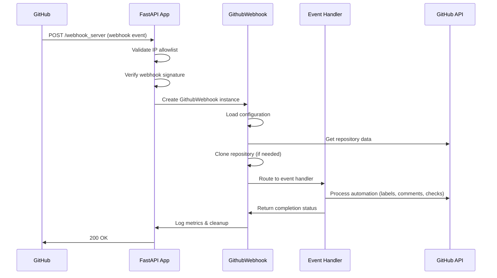

## Overview

The GitHub Webhook Server processes **six core GitHub webhook events** to automate repository management and pull request workflows. Each event triggers specialized handlers that perform specific automation tasks.

## Supported GitHub Events

### pull_request

**Triggers:** PR opened, reopened, edited, synchronized, ready_for_review

**Handler:** `PullRequestHandler` (`webhook_server/libs/handlers/pull_request_handler.py`)

**Automation Actions:**

<AccordionGroup>
  <Accordion title="PR Opened / Reopened" icon="folder-open">
    - Post welcome comment with available commands
    - Create tracking issue (if configured)
    - Assign reviewers based on OWNERS files
    - Apply labels (size, branch, WIP)
    - Queue CI/CD checks (tox, pre-commit, container builds)
    - Run conventional title validation
    - Trigger test oracle (if configured)
  </Accordion>

  <Accordion title="PR Synchronized (new commits)" icon="arrows-rotate">
    - Update PR size labels
    - Re-run CI/CD checks
    - Update merge status labels
    - Check for conflicts
    - Trigger test oracle on approval (if configured)
  </Accordion>

  <Accordion title="PR Edited (title/description changed)" icon="pen-to-square">
    - Update WIP label based on title
    - Re-run conventional title check (if title changed)
  </Accordion>

  <Accordion title="PR Ready for Review (draft → ready)" icon="circle-check">
    - Post welcome comment
    - Process as new PR (assign reviewers, labels, checks)
  </Accordion>
</AccordionGroup>

**Example Event Data:**

```json
{
  "action": "opened",
  "pull_request": {
    "number": 123,
    "title": "Add new feature",
    "user": {"login": "developer"},
    "base": {"ref": "main"},
    "head": {"ref": "feature-branch"},
    "draft": false
  },
  "repository": {
    "name": "my-repo",
    "full_name": "org/my-repo"
  }
}
```

### issue_comment

**Triggers:** Comment created on pull request

**Handler:** `IssueCommentHandler` (`webhook_server/libs/handlers/issue_comment_handler.py`)

**User Commands:**

| Command | Action | Permission Required |
|---------|--------|--------------------|
| `/verified` | Mark PR as verified | OWNERS |
| `/verified cancel` | Remove verification | OWNERS |
| `/hold` | Block PR merging | Anyone |
| `/hold cancel` | Unblock PR merging | Anyone |
| `/wip` | Mark as work in progress | Anyone |
| `/lgtm` | Approve changes (reviewers) | OWNERS reviewers |
| `/approve` | Approve PR (approvers) | OWNERS approvers |
| `/assign-reviewers` | Re-assign reviewers from OWNERS | Anyone |
| `/check-can-merge` | Check merge readiness | Anyone |
| `/reprocess` | Re-run entire PR workflow | OWNERS |
| `/retest <test-name>` | Run specific test | OWNERS |
| `/retest all` | Run all configured tests | OWNERS |
| `/cherry-pick <branch>` | Cherry-pick to branch | OWNERS |
| `/build-and-push-container` | Build and push container | OWNERS |
| `/test-oracle` | AI test recommendations | Anyone |
| `/automerge` | Enable auto-merge | Maintainers |

**Example Event Data:**

```json
{
  "action": "created",
  "issue": {
    "number": 123,
    "pull_request": {"url": "..."},
    "user": {"login": "reviewer"}
  },
  "comment": {
    "body": "/lgtm",
    "user": {"login": "reviewer"}
  },
  "repository": {
    "name": "my-repo",
    "full_name": "org/my-repo"
  }
}
```

### pull_request_review

**Triggers:** Review submitted, dismissed

**Handler:** `PullRequestReviewHandler` (`webhook_server/libs/handlers/pull_request_review_handler.py`)

**Automation Actions:**

- **Review Submitted:**
  - Add review labels (`approved-reviewer`, `lgtm-reviewer`, `changes-requested-reviewer`, `commented-reviewer`)
  - Update approval count
  - Check merge readiness
  - Trigger test oracle (if configured and approved)

- **Review Dismissed:**
  - Remove corresponding review labels
  - Update approval count
  - Re-check merge status

**Review States:**

<CardGroup cols={2}>
  <Card title="APPROVED" icon="circle-check" color="#22c55e">
    Adds `approved-<username>` label, counts toward minimum-lgtm requirement
  </Card>
  <Card title="CHANGES_REQUESTED" icon="circle-xmark" color="#ef4444">
    Adds `changes-requested-<username>` label, blocks merge
  </Card>
  <Card title="COMMENTED" icon="comment" color="#3b82f6">
    Adds `commented-<username>` label, informational only
  </Card>
  <Card title="LGTM Comment" icon="thumbs-up" color="#10b981">
    Comment with `/lgtm` adds `lgtm-<username>` label
  </Card>
</CardGroup>

### check_run

**Triggers:** GitHub Actions workflow completion, external CI check completion

**Handler:** `CheckRunHandler` (`webhook_server/libs/handlers/check_run_handler.py`)

**Automation Actions:**

- **Check Completed:**
  - Update merge eligibility based on required checks
  - Trigger auto-merge if all checks pass and `automerge` label present
  - Update `can-be-merged` check status
  - Re-evaluate branch protection rules

**Optimized Processing:**

```python
# Early exit conditions (no repository clone needed)
if action != "completed":
    return  # Skip 'created' action

if check_run_name == "can-be-merged" and check_run_conclusion != "success":
    return  # Skip failed can-be-merged checks

# Only clone repository when actually processing
await self._clone_repository(pull_request=pull_request)
```

**Example Event Data:**

```json
{
  "action": "completed",
  "check_run": {
    "name": "build",
    "status": "completed",
    "conclusion": "success"
  },
  "pull_requests": [
    {"number": 123}
  ]
}
```

### push

**Triggers:** Branch push, tag creation

**Handler:** `PushHandler` (`webhook_server/libs/handlers/push_handler.py`)

**Automation Actions:**

- **Tag Push:**
  - Build and publish container (if configured)
  - Publish to PyPI (if configured)
  - Create GitHub release

- **Branch Push:**
  - Update branch labels on related PRs
  - Trigger branch-specific CI/CD

**Example Event Data:**

```json
{
  "ref": "refs/tags/v1.0.0",
  "repository": {
    "name": "my-repo",
    "full_name": "org/my-repo"
  },
  "pusher": {
    "name": "maintainer"
  }
}
```

### Other Events

<Note>
While the server can receive any GitHub webhook event, only the six events above trigger active processing. Other events are logged but not processed.
</Note>

## Event Processing Flow

### High-Level Flow Diagram



### Detailed Processing Steps

<Steps>
  <Step title="Webhook Reception">
    FastAPI receives webhook at `/webhook_server` endpoint with event data in JSON body and headers (`X-GitHub-Event`, `X-GitHub-Delivery`, `X-Hub-Signature-256`)
  </Step>

  <Step title="Security Validation">
    - Verify client IP against GitHub/Cloudflare allowlist (if configured)
    - Validate HMAC-SHA256 signature using webhook secret
    - Check required headers and fields
  </Step>

  <Step title="Context Creation">
    Create structured logging context with webhook metadata (hook_id, event_type, repository, action, sender)
  </Step>

  <Step title="GithubWebhook Initialization">
    - Load repository configuration (global + `.github-webhook-server.yaml`)
    - Select GitHub token with highest rate limit
    - Initialize repository API clients
    - Track initial rate limit for metrics
  </Step>

  <Step title="Repository Data Pre-Fetch">
    Fetch comprehensive repository data once (collaborators, protected branches, labels) to minimize API calls
  </Step>

  <Step title="Repository Cloning">
    Clone repository to temporary directory (optimized with early exits for check_run events)
  </Step>

  <Step title="Handler Routing">
    Route event to specialized handler based on `X-GitHub-Event` header:
    - `push` → PushHandler
    - `pull_request` → PullRequestHandler
    - `issue_comment` → IssueCommentHandler
    - `pull_request_review` → PullRequestReviewHandler
    - `check_run` → CheckRunHandler
  </Step>

  <Step title="Event Processing">
    Handler performs event-specific automation (assign reviewers, apply labels, run checks, post comments)
  </Step>

  <Step title="Metrics & Logging">
    - Calculate token spend (rate limit consumption)
    - Write structured JSON log to `webhooks_YYYY-MM-DD.json`
    - Update context with final metrics
  </Step>

  <Step title="Cleanup">
    - Remove temporary repository clone
    - Close GitHub API connections
    - Clear logging context
  </Step>
</Steps>

## Event-Specific Processing Examples

### Example 1: Pull Request Opened

<CodeGroup>

```json Webhook Event
{
  "action": "opened",
  "pull_request": {
    "number": 456,
    "title": "feat: Add user authentication",
    "user": {"login": "developer"},
    "base": {"ref": "main"},
    "head": {"ref": "feat/auth"},
    "additions": 85,
    "deletions": 12
  }
}
```

```python Processing Flow
# 1. PullRequestHandler.process_pull_request_webhook_data()
await self.set_wip_label_based_on_title(pull_request)
await self.create_issue_for_new_pull_request(pull_request)
await self.process_opened_or_synchronize_pull_request(pull_request)

# 2. Inside process_opened_or_synchronize_pull_request()
await self.post_welcome_comment(pull_request)
await self.owners_file_handler.assign_reviewers(pull_request)
await self.labels_handler.update_pr_size_label(pull_request)  # size/S
await self.labels_handler.add_branch_label(pull_request)       # branch/main
await self.runner_handler.queue_checks(pull_request)
await self.check_if_can_be_merged(pull_request)
```

```json Result Labels
[
  "size/S",
  "branch/main",
  "wip"
]
```

</CodeGroup>

### Example 2: Issue Comment with /lgtm

<CodeGroup>

```json Webhook Event
{
  "action": "created",
  "issue": {"number": 456},
  "comment": {
    "body": "/lgtm",
    "user": {"login": "reviewer1"}
  }
}
```

```python Processing Flow
# 1. IssueCommentHandler.process_comment_webhook_data()
comment_body = self.hook_data["comment"]["body"]
if "/lgtm" in comment_body:
    await self.process_lgtm_command(pull_request, commenter)

# 2. Inside process_lgtm_command()
if commenter in self.owners_file_handler.all_repository_reviewers:
    await self.labels_handler.add_label(pull_request, f"lgtm-{commenter}")
    await pull_request.create_issue_comment("✅ LGTM added by @reviewer1")
    await self.check_if_can_be_merged(pull_request)
```

```json Result Labels
[
  "size/S",
  "branch/main",
  "lgtm-reviewer1"
]
```

</CodeGroup>

### Example 3: Check Run Completed

<CodeGroup>

```json Webhook Event
{
  "action": "completed",
  "check_run": {
    "name": "build",
    "status": "completed",
    "conclusion": "success"
  },
  "pull_requests": [{"number": 456}]
}
```

```python Processing Flow
# 1. CheckRunHandler.process_pull_request_check_run_webhook_data()
if check_run_conclusion == "success":
    if await self.labels_handler.label_exists(pull_request, "automerge"):
        await pull_request.merge(merge_method="SQUASH")
        logger.info("Auto-merged PR #456")
    else:
        await self.check_if_can_be_merged(pull_request)

# 2. Update can-be-merged check
await self.create_or_update_check_run(
    name="can-be-merged",
    conclusion="success",
    output={"title": "Ready to merge", "summary": "All checks passed"}
)
```

</CodeGroup>

## Event Filtering & Optimization

### Draft PR Handling

```python
if await asyncio.to_thread(lambda: pull_request.draft):
    allow_commands = self.config.get_value("allow-commands-on-draft-prs")
    
    # Only allow issue_comment events when explicitly configured
    if allow_commands is None or self.github_event != "issue_comment":
        logger.debug("Pull request is draft, skipping")
        return None
```

### Check Run Optimization

<Note>
**Performance Impact:** Early exit conditions reduce repository cloning by 90-95%, saving 5-30 seconds per webhook.
</Note>

```python
# Skip cloning for non-completed check runs
if action != "completed":
    return None

# Skip cloning for failed can-be-merged checks
if check_run_name == "can-be-merged" and check_run_conclusion != "success":
    return None

# Only clone when actually needed
await self._clone_repository(pull_request=pull_request)
```

## Event Configuration

Configure which events trigger specific automation in `config.yaml`:

```yaml
repositories:
  my-repository:
    name: my-org/my-repository
    
    # Enable specific features
    verified-job: true        # Enable verified label automation
    pre-commit: true          # Run pre-commit on PR events
    
    # Test oracle triggers
    test-oracle:
      triggers:
        - approved            # Run on approval
        - pr-opened          # Run on PR opened
        - pr-synchronized    # Run on new commits
    
    # Auto-merge configuration
    set-auto-merge-prs:
      - main                  # Enable auto-merge for main branch
    
    # Required checks for merge
    protected-branches:
      main:
        include-runs:
          - build
          - test
          - pre-commit
```

## Related Documentation

<CardGroup cols={2}>
  <Card title="Architecture" icon="sitemap" href="/concepts/architecture">
    Event-driven handler architecture overview
  </Card>
  <Card title="User Commands" icon="terminal" href="/features/user-commands">
    Complete list of issue comment commands
  </Card>
  <Card title="Configuration" icon="gear" href="/configuration">
    Event-specific configuration options
  </Card>
  <Card title="API Reference" icon="code" href="/api/webhook-endpoint">
    Webhook endpoint specifications
  </Card>
</CardGroup>